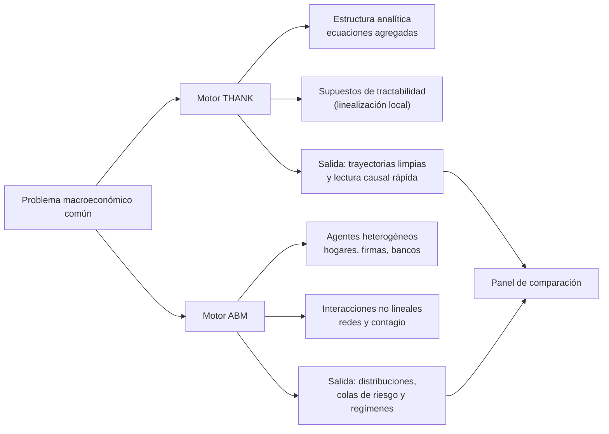
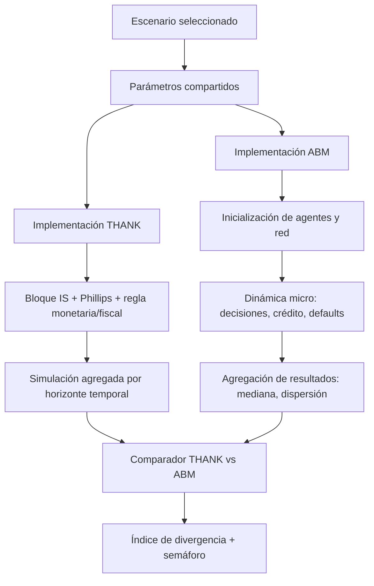
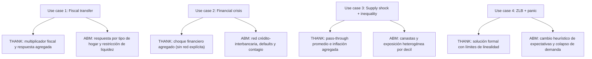

# THANK vs ABM Macroeconomics Simulator

An **R Shiny** app to study the same macroeconomic problem through two simultaneous approaches:

- **THANK** (*Tractable Heterogeneous Agent New Keynesian*): a compact analytical structure, useful for causal interpretation, monetary/fiscal policy, and parameter sensitivity.
- **ABM** (*Agent-Based Model*): a heterogeneous-agent system with nonlinear interactions, useful for financial contagion, regime shifts, and emergent dynamics.

The core idea is that a macroeconomist should not choose “one or the other,” but **use both in parallel** and compare outcomes to distinguish:

1. What is robust to assumptions (THANK–ABM convergence).
2. What critically depends on simplifying assumptions (THANK–ABM divergence).

---

## What problem does this app solve?

In applied practice, many structural models (including THANK/HANK variants) can be very informative, but they depend on tractability assumptions: local linearization, disciplined expectations, summarized financial markets, etc.

When the environment enters nonlinear zones (panic, default cascades, major rule changes in behavior), those simplifications can degrade inference. This is where ABM acts as an **epistemic stress layer**: it tests whether the policy message survives when strong assumptions are relaxed.

This app lets you run both engines with the same scenario and comparable parameters, and provides a divergence panel for fast diagnostics.

---

## Project architecture

```text
app/
├── app.R
├── ui.R
├── server.R
├── modules/
│   ├── thank_model.R
│   ├── abm_model.R
│   ├── comparison.R
│   └── scenario_loader.R
├── scenarios/
│   ├── fiscal_transfer.yaml
│   ├── financial_crisis.yaml
│   ├── supply_shock.yaml
│   └── liquidity_trap.yaml
├── data/
│   └── calibration_params.csv
└── www/
    └── styles.css
```

---

## ¿Qué es THANK y qué es ABM? (explicación conceptual)



En este proyecto, **THANK** funciona como la capa estructural rápida para interpretar mecanismos de política, y **ABM** como la capa de estrés para validar si esa lectura sobrevive cuando hay heterogeneidad fuerte, fricciones financieras o cambios de régimen.



---

## Implemented scenarios and theoretical interpretation

### 1) Fiscal transfer (expected convergence)
- **Intuition**: with moderate frictions and no extreme financial dislocation, THANK and ABM usually match in multiplier order of magnitude.
- **Message**: when NK assumptions hold, THANK provides a fast and transparent guide.

### 2) Financial crisis with contagion (divergence)
- **Intuition**: interconnected defaults and a credit crunch generate network nonlinearities.
- **THANK**: typically underestimates recession depth if contagion is not explicitly modeled.
- **ABM**: reproduces failure cascades and second-round effects.

### 3) Supply shock with inequality (strong divergence)
- **Intuition**: the shock hits differently by decile, basket composition, and liquidity constraints.
- **THANK**: by averaging, it may hide the distribution of inflation damage.
- **ABM**: shows winners/losers and emergent distributional paths.

### 4) Liquidity trap / ZLB with panic (assumption failure)
- **Intuition**: with the policy rate at zero and unstable expectations, behavior is neither smooth nor linear.
- **THANK**: may have a formal solution but lose behavioral realism.
- **ABM**: allows heuristic switching and endogenous demand collapse.

### Mapa de implementación por use case (THANK vs ABM)



Este mapa resume cómo se implementa cada escenario en ambos motores: THANK prioriza la claridad estructural y ABM prioriza la riqueza de comportamiento para detectar fragilidad fuera del entorno de supuestos.

---

## THANK vs ABM comparison: when each framework “wins”

### THANK strengths
- High structural interpretability.
- Fast policy counterfactual analysis.
- Strong performance near steady state with bounded nonlinearities.

### ABM strengths
- Captures network interactions, rich heterogeneity, and regime changes.
- Supports study of risk tails, rare events, and deep nonlinearities.
- Produces distributions (not only average trajectories).

### Practical rule
- **THANK** as the main synthesis and policy communication engine.
- **ABM** as the robustness and external assumption-validation engine.

They are not perfect substitutes; they are complements.

---

## Why should a macroeconomist work “from both sides”?

1. **Analytical discipline + emergent realism**: THANK organizes causal intuition; ABM prevents overconfidence in simplifications.
2. **Better policy-risk management**: if both converge, confidence increases; if they diverge, fragile zones are detected before recommending intervention.
3. **Methodological transparency**: model comparison clarifies which outcomes come from data/mechanisms and which from closure assumptions.
4. **Avoiding false negatives in crises**: with only a tractable framework, systemic-event severity can be underestimated.

---

## Why does omitting ABM reduce THANK’s analytical robustness?

If THANK is used alone, validation remains “internal” to its own assumption system. That can create:

- **Circularity risk**: a model confirms what its own hypotheses already imposed.
- **Underestimation of nonlinearities**: contagion, cascading failures, and panic are damped.
- **Loss of distributional signal**: aggregate averages hide heterogeneity relevant for welfare and policy.
- **Overconfidence in local responses**: good approximation near equilibrium, weak outside it.

That is why incorporating ABM does not “replace” THANK; it makes it **more robust** by forcing it to pass tests outside the environment it was designed for.

---

## Comparison panel (pedagogical core)

The app computes a divergence index (normalized RMSE between the THANK trajectory and ABM median) and summarizes it with a traffic light:

- **Green**: convergence (NK assumptions are reasonable for that scenario).
- **Yellow**: partial divergence (THANK under/overestimates a variable).
- **Red**: severe divergence (ABM is more reliable in that regime).

This helps transform an abstract methodological debate into an operational diagnostic.

---

## Local run

```r
install.packages(c(
  "shiny", "bslib", "plotly", "igraph", "dplyr", "tidyr", "purrr", "yaml", "viridis"
))

shiny::runApp("app")
```

## Run with Docker Compose

```bash
docker compose up --build
```

Then open `http://localhost:3838`.

To stop the services:

```bash
docker compose down
```

---

## Executive summary

- THANK provides structural clarity and speed.
- ABM provides interaction realism and validation in extreme scenarios.
- Combining THANK+ABM improves inference quality and reduces the risk of fragile recommendations.
- In applied macro, **comparing both is not redundancy: it is scientific quality control**.

---

## Extended summary: why the dual THANK + ABM approach matters

### The clearest analogy
Think of a structural engineer designing a bridge with two tools:

- **Analytical calculation**: fast, auditable, easy to communicate.
- **Finite element simulation (FEM)**: more costly, but captures effects simplified formulas miss.

For routine cases, the analytical tool may be enough. For extreme scenarios (crosswinds, earthquakes, simultaneous structural fatigue), simulation is no longer optional. The same applies in macroeconomics: when regime-break risk exists, using only one framework can induce severe diagnostic errors.

### The underlying epistemic reason
The point is not only technical: it is **what kind of certainty is communicated**.

- THANK can provide precise and clean policy numbers.
- But those numbers depend on assumptions (rational expectations, local linearization, simplified financial markets, distributional stability).
- If those assumptions fail, the forecast may not only lose precision; it can be wrong in direction.

ABM complements this by not imposing that structural smoothness and by helping identify when the “clean number” stops being reliable.

### Four cases where dual analysis is strongly recommended
1. **Potential nonlinearities**: banking crisis, FX run, panic.
2. **Transitioning distribution**: post-crisis, post-reform, or post-conflict shocks.
3. **Central financial channel**: credit, leverage, spreads, and contagion.
4. **Unanchored expectations**: high uncertainty, panic episodes, persistent ZLB.

### The symmetric trap: using only ABM can also fail
- Lower causal traceability for policy communication.
- Greater sensitivity to behavioral/calibration assumptions.
- Lower acceptance in some formal evaluation circuits.

That is why this project does not propose replacement, but **disciplined complementarity**: THANK for structure and interpretation; ABM for external robustness and tail scenarios.

### Suggested operational rule
| Situation | THANK only | ABM only | Dual approach |
|---|---|---|---|
| Routine rate adjustment | ✅ | ❌ | Optional |
| Moderate fiscal policy | ✅ | ❌ | Optional |
| Systemic banking crisis | ❌ | ❌ | ✅ |
| Major distributional reform | ❌ | ❌ | ✅ |
| Severe external shock (emerging market) | ❌ | ❌ | ✅ |
| Liquidity trap / ZLB | ❌ | ❌ | ✅ |
| Regulatory stress test | ❌ | ✅ | Optional |

### Integration in central banks (summary)
Recent practice in advanced central banks combines structural frameworks (DSGE/HANK/THANK) with layered ABMs:

1. **Baseline forecasting and communication** with structural models.
2. **Financial stress testing** with network/contagion ABMs.
3. **Extreme/nonlinear scenarios** with heterogeneous macro ABMs.

The practical lesson for this repository is direct: not using ABM as a contrast can leave THANK assumptions without external validation and reduce analytical robustness in the episodes where getting it right matters most.

### One-line synthesis
> **THANK tells you the optimal answer inside the model; ABM tells you whether the model survives contact with reality.**
